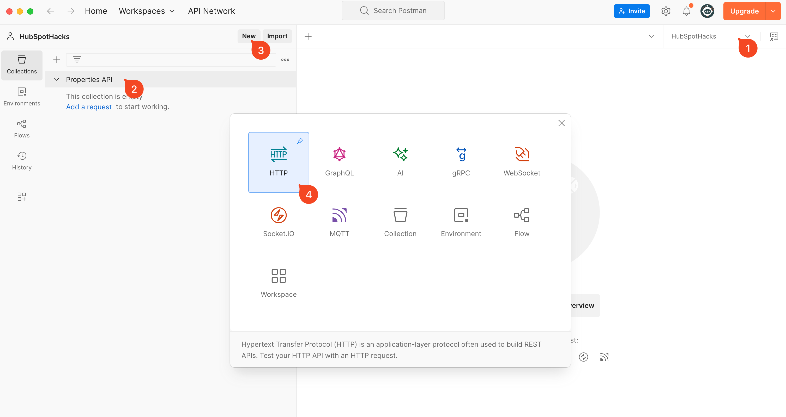
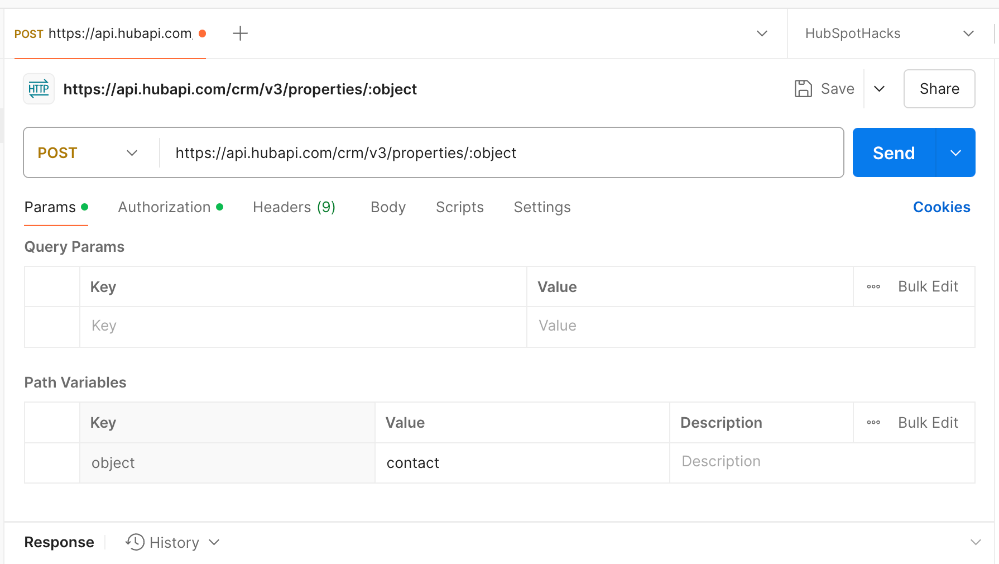
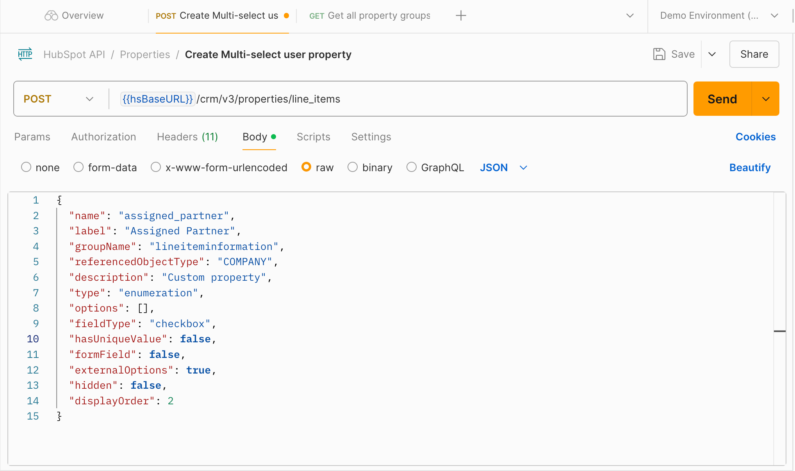
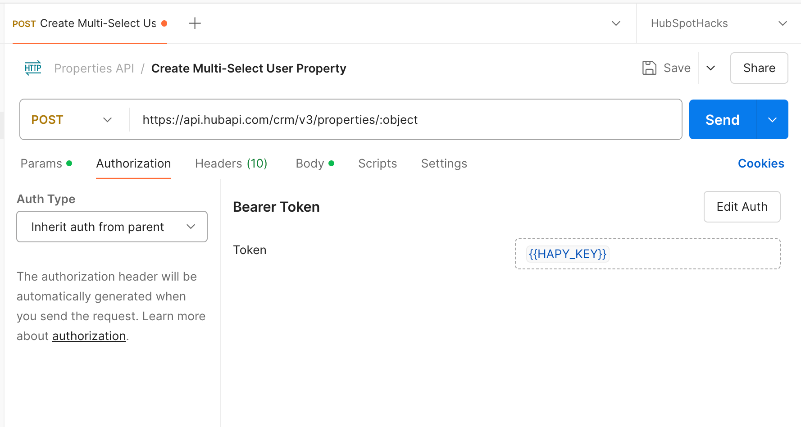
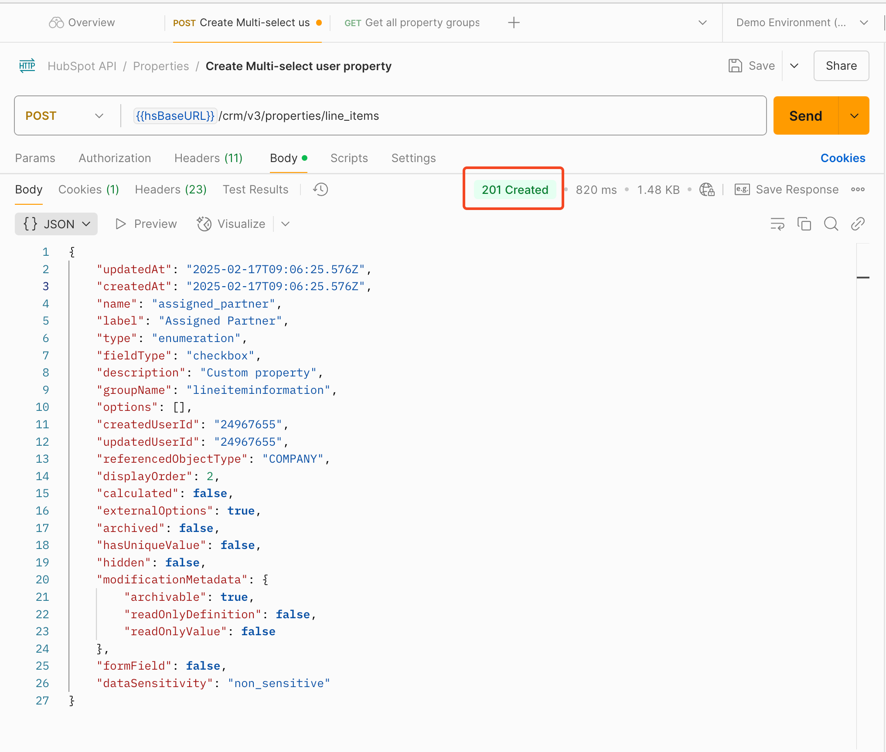
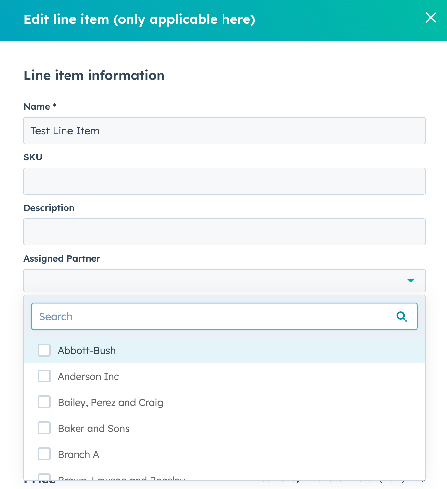

# Creating CRM Lookup Fields

### #FreeCRM  #HubSpotAPI 

## Summary

Dynamically populate dropdown field options using records within a given object, providing an alternative solution for creating and managing associated records.

## Background

During the [last tutorial](../Creating Multi-Select User Properties/Guide.md) where we created Multi-Select User Properties, you may have noticed a particularly special property within the request `body`:

	"referencedObjectType": "OWNER"

Despite what the Properties API says about the `referencedObjectType` parameter:

> *(The parameter) should be set to 'OWNER' when 'externalOptions' is true, which causes the property to dynamically pull option values from the current HubSpot users.*

You can replace the "OWNER" value with another object name, and all of a sudden, you now have a fully dynamic lookup property.

What's better, you can choose whether you want to restrict the property to a single value creating a 1-to-many (single dropdown) or multiple values (multiple checkbox) for a many-to-many relationship.

This might not seem all that exciting, when you consider that Associations are very much a thing - is that this allows you to specify particularly **any** standard object with the CRM, including Products, Campaigns, Forms, etc.

This opens up some crazy possibilities... Consider these use-cases:

- Multi-select property on Companies or Deals for "Products of Interest", pulling from the Products library
- Multi-select property on Contacts or Leads for "Marketing Campaigns", you guessed it, from the Campaigns tool
- Single dropdown property on Line Items for "Assigned Partner" for assigning Companies.

The only limitation I've identified *(and if anyone can find a workaround, PLEASE let me know)* is that **custom objects aren't supported.**

With all that out of the way, let's get into it!

## Instructions

### Prerequisites 

- HubSpot Private App with the scope of `crm.schemas.{object}.write`

### Using Node.JS

If you prefer to do things within your code editor, I've provided an [example Node.JS script](script.js) using Axios.

### Using API Client (Postman)

1. **Open Postman, select your Environment and Collection, click "New" and click "HTTP".**



2.  **Setup your Request Parameters as shown below:**
	1. Method: `POST`
	2. URL: `https://api.hubapi.com/crm/v3/properties/:object`
	3. Path Variables: `{Object Name}` (eg. `contact`)



3. **Setup your Request Body as shown below:**
	1. Type: `raw`
	2. Format: `JSON`
	3. Body:

```
{
  "name": "{name}",
  "label": "{label}",
  "groupName": "{groupName}",
  "referencedObjectType": "{referencedObject}",
  "description": "{description}",
  "type": "enumeration",
  "options": [],
  "fieldType": "{fieldType}",
  "hasUniqueValue": false,
  "formField": false,
  "externalOptions": true,
  "hidden": false,
  "displayOrder": 2
}
```

**The values you need to adjust to suit your needs are:**

- Name
- Label
- Description
- Group Name 
	If you're unsure what your group name is, you can use
	`GET https://api.hubapi.com/crm/v3/properties/{objectType}/groups`
- Referenced Object
	Note: you can only specify default HubSpot Objects, in singular uppercase
	*(eg.) OWNER, COMPANY, FORM*
- Field Type

**See example below:**



4. **Ensure to setup your Authorization**

	*I recommend setting up an Environment to store your Private Tokens - then setting up Authorization within a Collection so all Requests within can Inherit auth from parent like shown below:*



5. **Verify your setup and click Send**

	After sending the API request, you should receive a response from the HubSpot API like shown below:



In HubSpot, you should now see your Custom Property, ready to be used on your records!


